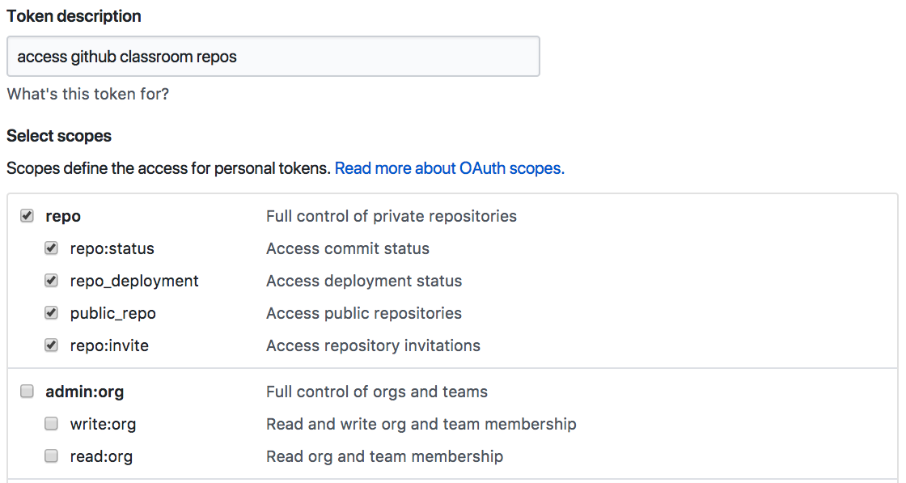

<!-- README.md is generated from README.Rmd. Please edit that file -->

```{r, echo = FALSE}
knitr::opts_chunk$set(
  collapse = TRUE,
  comment = "#>",
  fig.path = file.path("tools", "README-")
)
```

# GitHubClassroom (GHC) Tools

This package is intended to facilitate interactions with student repositories created via [GitHub Classroom](https://classroom.github.com/) for educators who may not be as familiar with git and the automation of git commands across multiple repositories. The package uses git commands internally so individual students' repositories can be treated just like any other cloned repository (i.e. with full git functionality) if needed. 

## Installation

You can install `ghctools` from github with the devtools package. If you do not already have many of the dependencies installed (dplyr, ghql, httr, knitr, rmarkdown), this may take a moment to install. Since much of the functionality of this package is based on interactions with GitHub using git commands, it requires a fully functional local installation of command line git. To check whether you have git installed, run `git --version` from your operating system's terminal, which will print which version of git is installed (if any). If you don't have git yet or an older version (newer than 2.0 is highly recommended), please consult the [Git Installation Instructions](https://www.atlassian.com/git/tutorials/install-git) for your operating system.

```{r gh-installation, eval = FALSE}
install.packages("devtools") # skip this if you have devtools already installed
devtools::install_github("KopfLab/ghctools")
```

## Security

Access to private repositories within the GitHub Classroom organization (e.g. to clone all students' assignment repositories for a private homework assignment) and push access to the student's repositories (e.g. for adding solution files or other updates) is managed via access token for security. To generate an [access token](https://github.com/settings/tokens) for your classroom, follow the [GitHub instructions](https://help.github.com/articles/creating-a-personal-access-token-for-the-command-line/) and make sure to allow full `repo` access in the scopes (see screenshot below) - additional administrative privileges for your classroom token are not necessary and not recommended. Keep the token secure and use it when first fetching the students' repositories (`ghc_repos_git_clone_respositories(..., token = "my-token")`) as detailed in the [User Guide](user-guide) below. The token will be stored in the local `git remote origin` for each repository, thus allowing easy `git pull` and `git push` access thereafter both through **ghctools** functions and directly via the git command line. Do NOT post your token publicly.

#### Screenshot of an example token setup:



## User guide

All **ghctools** functions start with the **ghc_repos_git_** prefix to make it easy to search for the right function via code completion in IDEs such as RStudio.

### Fetching Assignment Information from GitHub

To simply find information about students' repositories for an assignment, provide the name of the GitHubClassroom organization, the prefix of the assignment repository and an access token (required to query the GitHub API). This will return a data frame with information about the repository names, creation date, last push and last pull request (date and user).

```{r, eval = FALSE}
library(ghctools)
ghc_repos_get_github_information(
  prefix = "assignment-prefix",
  org = "my-classroom",
  token = "my-access-token"
)
```

### Cloning Assignment Repositories

To actually clone all students' repositories for an assignment, provide the name of the GitHubClassroom organization, the prefix of the assignment repository, an access token (only necessary if repositories are private and/or you intend to push changes back to GitHub), and optionally, a folder where to clone to. 

```{r, eval = FALSE}
library(ghctools)
ghc_repos_git_clone(
  prefix = "assignment-prefix-",
  org = "my-classroom",
  folder = ".",
  token = "my-access-token"
)
```

### Updating Assignment Repositories

`ghc_repos_git_clone` and all other command functions in the **ghctools** package take the `prefix` parameter as their first parameter and return it invisibly and thus can be used in pipelines that act on the same set of students' repositories. For example, the following pipeline would make sure the `master` branch is up to date for all repositories that match the prefix, create a new branch in the repositories, copy a file to this branch in all repositories, commit the change and push it back to the server.

```{r, eval = FALSE}
library(ghctools)
"assignment-prefix" %>% 
  # make sure master branch is active
  ghc_repos_git_switch_branch(branch = "master") %>% 
  # pull latest changes from github
  ghc_repos_git_pull() %>% 
  # create a new branch based on master (could be based on a commit instead)
  ghc_repos_git_create_branch(branch = "new_branch", parent = "master") %>% 
  # copy a file to all repositories (will overwrite existing)
  ghc_repos_copy_to(from = "README.md", git_add = TRUE) %>% 
  # commit the change
  ghc_repos_git_commit(message = "new file added") %>% 
  # push back to the server
  ghc_repos_git_push()
```

### Fetching Information on Local Repositories

To get a better sense where the local clones of the students' GitHubClassroom repositories are at, either use the standard command `ghc_repos_git_status()` that runs `git status`, or use the summary information function `ghc_repos_get_local_information()` which returns a more compact data frame with details on the repositories that match the assignment prefix including the currently active branch, available branches, status relative to the origin, and number of modified files, etc.

```{r, eval = FALSE}
# git status
ghc_repos_git_status("assignment-prefix-")

# summary information
ghc_repos_get_local_information("assignment-prefix-")
```


### Interacting with Local Repositories

Interaction with local assignment repositories is not limited to the standard functions implemented by the **ghctools** package. If you are familiar with git command line command syntax, you can use the `ghc_repos_run_git_command()` function to run any git command across a set of assignment repositories.

```{r, eval = FALSE}
# custom git command
ghc_repos_run_git_command("assignment-prefix", command = "git status -b")
```

